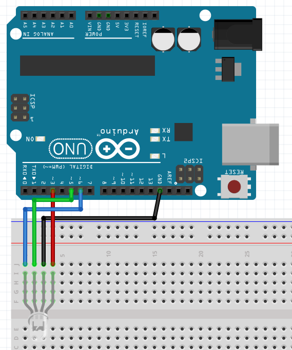
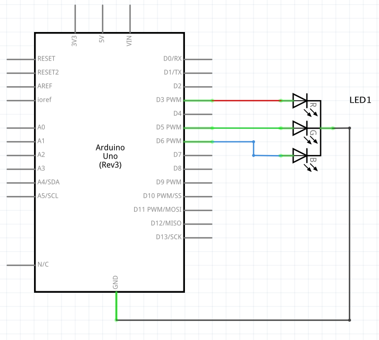

# RGB LED

An RGB LED controller for AT microcontrollers with bonus RSpec formatter.

## Install

### Bundler: `gem 'rgb_led'`

### RubyGems: `gem install rgb_led`

## Setup

Upload the `src/rgb_led.ino` to the microcontroller and use the following setup:

### Breadboard



### Schematic



## Usage

### Executable

The executable is a simple `pry` based REPL.  
Note that all usage here is applicable with the "Library" section below as well.

#### Simple Usage

```sh
$ rgb_led
RGB LED > red
RGB LED > green
RGB LED > blue
RGB LED > update(1, 0.1, 0)
RGB LED > off
RGB LED > exit
```

#### Pulsing Red

Since it's just using a Ruby `pry` REPL, we can program the LED to do whatever we want.  
Here, we're pulsing the LED red using a sine wave:

```sh
$ rgb_led
RGB LED > x = 0.0
RGB LED > loop do
RGB LED >   value = (Math.sin(x) + 1.0) / 2.0 # sin is a range from -1.0 to 1.0, so we modify it to a 0.0...1.0 range
RGB LED >   update(value, 0, 0)
RGB LED >   x += 0.01
RGB LED > end
```

#### Color Gem

The [color](https://github.com/halostatue/color) gem can output red, green, and blue values in the 0.0 to 0.1 range, so we're able to use it to parse HTML/CSS color strings to set our LED color:

```sh
$ rgb_led
RGB LED > require 'color'
RGB LED > color = Color::RGB.from_html('#47021E')
RGB LED > update(color.r, color.g, color.b)
```

### Library

#### With Block

```rb
require 'rgb_led'

RGBLED::Controller.open('/dev/usbdevicepath') do |controller|
  controller.red
  sleep 1
  controller.green
  sleep 1
  controller.blue
  sleep 1
  controller.update(1, 0.1, 0) # Yellow. Really depends on how bright each diode is within the LED
  sleep 1
  controller.off
end
```

#### Without Block

```rb
require 'rgb_led'

controller = RGBLED::Controller.open('/dev/usbdevicepath')
# ...
controller.close
```

## RSpec Formatter

> Note: You can use multiple formatters with RSpec by passing multiple `--format` options.

**spec_helper.rb**

```rb
RSpec.configure do |config|
  # ...
  config.rgb_led_path = '/dev/usbdevicepath'
  # ...
end
```

**.rspec**

```
--require 'rgb_led/rspec_formatter'
--format RGBLED::RSpecFormatter
```

## Copyright

Copyright © 2016 Ryan Scott Lewis <ryanscottlewis@gmail.com>.

The MIT License (MIT) - See License.md for further details.

